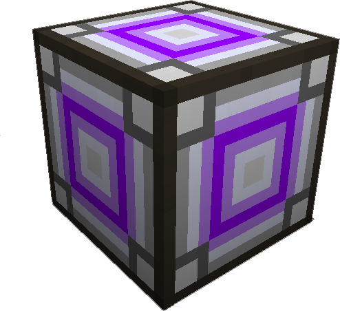

---
categories:
  - Advanced Tools/Utilities
item_ids:
  - appliedenergistics2:condenser
title: Matter Condenser
---

Has
two key functions, ellimination of excess materials in a cheap manor, and the
production of <ItemLink id="appliedenergistics2:singularity"/> and

<ItemLink id="appliedenergistics2:matter_ball" />.

Can accept both fluids and items to be destroyed. Each item or fluid will
count as one additional energy. This energy can be stored on <ItemLink
id="appliedenergistics2:1k_item_cell_component"/>, <ItemLink
id="appliedenergistics2:4k_item_cell_component"/>, <ItemLink
id="appliedenergistics2:16k_item_cell_component"/> or <ItemLink
id="appliedenergistics2:64k_item_cell_component"/>. 256 Energy is
required to generate a <ItemLink
id="appliedenergistics2:matter_ball"/>, 256,000 respecitvely for the

<ItemLink id="appliedenergistics2:singularity" />.

<RecipeFor id="appliedenergistics2:condenser" />
