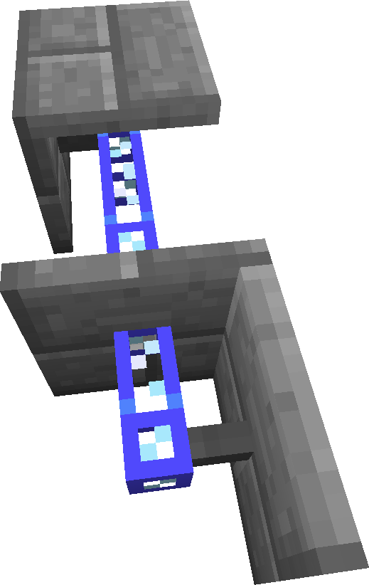

---
item_ids:
  - appliedenergistics2:facade
title: Cable Facade
---

Facades
are crafted with any facadeable block in the middle of the crafting table, and
4 cable anchors around it. They can be mounted on any varient of cables, and
around buses. They can be used to create a solid surface for things like
levers or buttons, but are for the most part decrative in nature.
