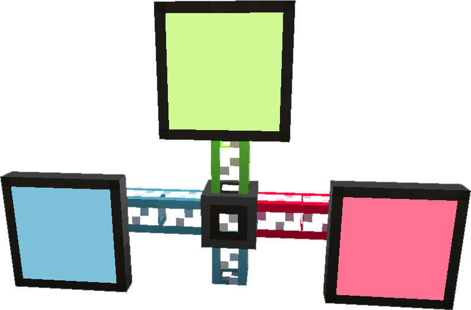
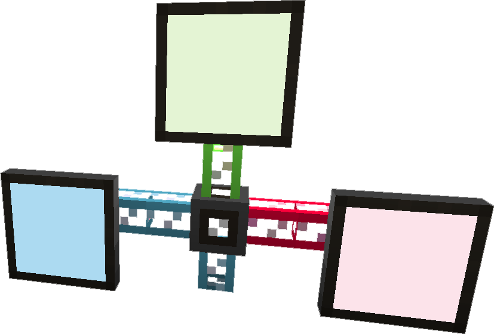
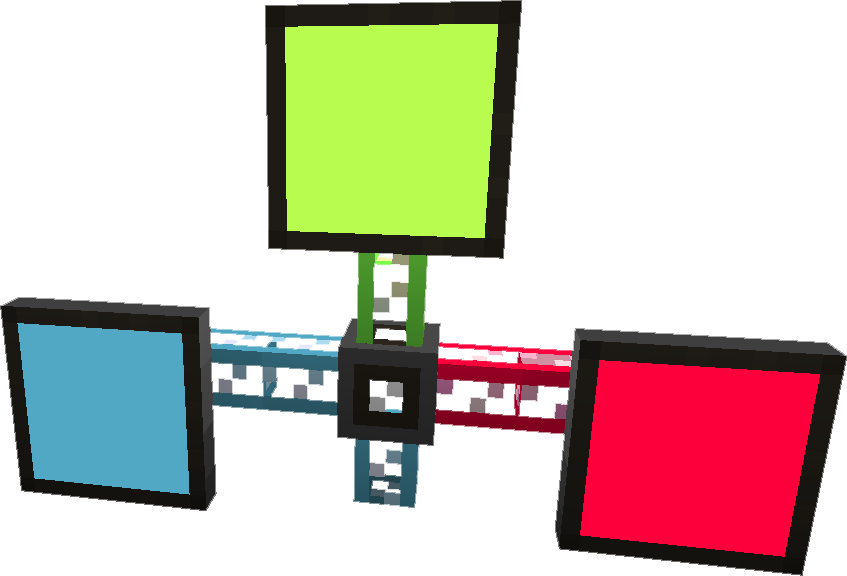

Mostly decorative powered light source that can be attached to <ItemLink id="appliedenergistics2:fluix_glass_cable"/> or other non dense
cables. Also used for crafting <ItemLink id="appliedenergistics2:terminal"/>, <ItemLink id="appliedenergistics2:interface_terminal"/>
and <ItemLink id="appliedenergistics2:storage_monitor"/>.

<RecipeFor id="appliedenergistics2:semi_dark_monitor" />

An alternate variation of <ItemLink id="appliedenergistics2:semi_dark_monitor"/>

<RecipeFor id="appliedenergistics2:monitor" />

An alternate variation of <ItemLink id="appliedenergistics2:semi_dark_monitor"/>

<RecipeFor id="appliedenergistics2:dark_monitor" />
