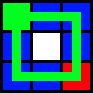
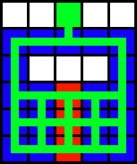
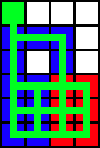

Applied Energistics 2's [ME Networks](../me-network.md) require
Channels to support devices which use networked storage, or other network
services. Most devices such as standard cables, and machines can only support
up to 8 channels. However <ItemLink id="appliedenergistics2:fluix_covered_dense_cable"/> can support up
to 32 channels, the only other devices capable of transmitting 32 are <ItemLink id="appliedenergistics2:me_p2p_tunnel" />
and the [Quantum Network Bridge](quantum-bridge.md).

A Network without a <ItemLink id="appliedenergistics2:controller"/>
is considered to be Ad-Hoc, and can support up to 8 channel using devices.
Once you exceed 8 devices the networks channel using devices will shutdown,
you can either remove devices, or add a <ItemLink id="appliedenergistics2:controller"/>.

While using [Ad-Hoc](ad-hoc-networks.md) networks each device will
use 1 channel network wide, this is very different from how <ItemLink
id="appliedenergistics2:controller"/> allocate channels based on
shortest route.

Channels will consume 1⁄128 ae/t per node they transverse, this means that by
adding a <ItemLink id="appliedenergistics2:controller"/> for a
network with 8 devices and over 96 nodes your power usage might actually
decrease power consumption because it changes how channels are allocated.

When using a <ItemLink id="appliedenergistics2:controller"/>
Channels must route via the shortest path from the <ItemLink
id="appliedenergistics2:controller"/> to the device. If the path is
already maxed out, some devices may not get their required channels, use
colored cables, cable anchors and tunnels to your advantage to make sure your
channels go in the path you desire.

## Introduction to Channels:

## Design

Designing your layouts with channels can be tricky because of their shortest
route nature, if any specific spot in your system has two possible routes, you
may find yourself returning home from a mining trip to see half your devices
offline. Take a look at the following example:

---

Equal Length Route

In the above image the controller is represented by the Green Block, Cables or
machines by green lines. The blue square indicate which Locations only have 1
route; this is good, but there is a red block, which indicates that there is
two possible routes, this can be bad, especially if your exceeding 8 channels
on cable, or machines for a specific block of machines. Now that you can
understand that basic issue and diagram look at these other diagrams.

You can see that depending on how you run your cable, you might end up with
different possible outcomes in a block of machines, you can also see that
using a controller you can ensure that the channels equilibrium is kept from a
straight line.

In the second setup you can see that the middle line is red, however its
important to remember that it only matters if that line of machines uses
channels, if that line was for instance molecular assemblers, it wouldn't
matter, so that could be a valid setup for building.

In the Last two you can see that you might run an extra cable into a block of
machines, and it might appear to work, but you can see that it can break quite
easily.

Now that you understand how this works, I'll leave you with one final piece of
helpful information, if you run into a situation where you can't use a
controller, and your design is imbalanced, consider using p2p tunnels, since a
tunnel connection is considered a single "hop" you can get the system to have
a different outcome.

### Using P2P-Tunnels to adjust route lengths

One last important note about this, you can see that the p2p tunnel is
directly on the controller, and directly on the block of machines at the
bottom of the setup, this is done because the in and out tunnel are both
considered "a node", so the two cable from the controller and in and out
tunnel balance to create the final balanced setup.
