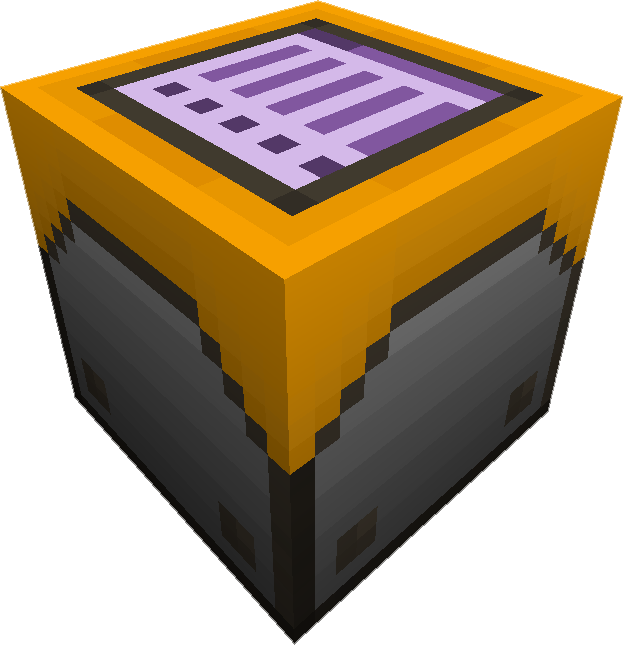

---
categories:
  - ME Network/Misc
item_ids:
  - ae2:security_station
title: ME Security Terminal
---

Allows you to configure which users, and what permissions the users have with
the ME System. By existing it enforces permissions on the usage of the system.

The security system does not prevent destructive tampering, removing cables /
machines or breaking of drives is not directly provided by the security
Terminal. If you need to protect your system from physical vandalism you will
need another form of physical security. This block provides Network level
security.

The player who places the <ItemLink
id="security_station"/> has full control over
the network and cannot exclude himself any rights. By adding a blank <ItemLink
id="biometric_card"/> you define a default
behavior for every player who has no own <ItemLink
id="biometric_card"/> registered.

Other than adding security on software layer, you can link up your <ItemLink
id="wireless_terminal"/> with the network and
access it wirelessly.

### The GUI

 |

1. **Sort Order  
   ** Toggle sorting direction

2. **Search Box Mode  
   ** Auto Search

3. **Biometric Card**
4. **Deposit  
   ** User is allowed to store new items into storage

5. **Withdraw  
   ** User is allowed to remove items from storage

6. **Craft  
   ** User can inititate new crafting jobs

7. **Build  
   ** User can modify the physical structure of the network and make
   configuration changes.

8. **Security  
   ** User can access and modify the security terminal of the network

9. **Wireless Access Terminal  
   ** Links up the WAT to the network

10. **Linked up WAT**

---|---

<RecipeFor id="security_station" />
