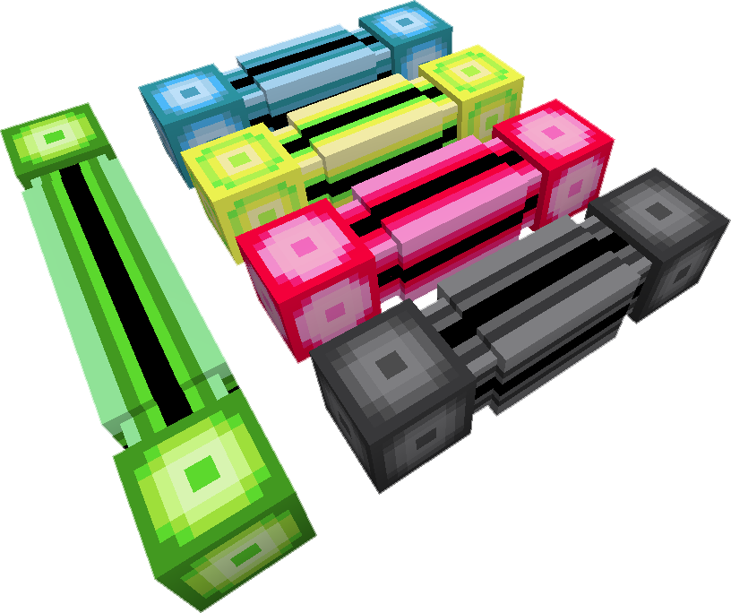

---
categories:
  - ME Network/Network Connections
item_ids:
  - appliedenergistics2:white_covered_dense_cable
  - appliedenergistics2:orange_covered_dense_cable
  - appliedenergistics2:magenta_covered_dense_cable
  - appliedenergistics2:light_blue_covered_dense_cable
  - appliedenergistics2:yellow_covered_dense_cable
  - appliedenergistics2:lime_covered_dense_cable
  - appliedenergistics2:pink_covered_dense_cable
  - appliedenergistics2:gray_covered_dense_cable
  - appliedenergistics2:light_gray_covered_dense_cable
  - appliedenergistics2:cyan_covered_dense_cable
  - appliedenergistics2:purple_covered_dense_cable
  - appliedenergistics2:blue_covered_dense_cable
  - appliedenergistics2:brown_covered_dense_cable
  - appliedenergistics2:green_covered_dense_cable
  - appliedenergistics2:red_covered_dense_cable
  - appliedenergistics2:black_covered_dense_cable
  - appliedenergistics2:fluix_covered_dense_cable
title: ME Dense Cable
---

Higher Capacity
cable, can carry 32 channels unlike standard cable which can only carry 8,
however it doesn't support buses so you must first step down from dense to a
smaller cable (such as <ItemLink
id="appliedenergistics2:fluix_glass_cable"/> or <ItemLink
id="appliedenergistics2:fluix_smart_cable"/>) before using buses or
panels. Shows load similarly to <ItemLink
id="appliedenergistics2:fluix_smart_cable"/>, with each line lit
representing four channels in use.

<RecipeFor id="appliedenergistics2:fluix_covered_dense_cable" />
