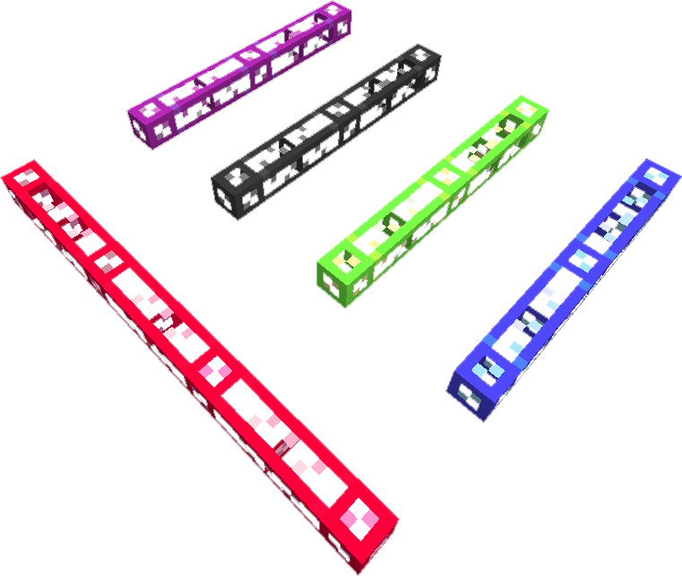

---
categories:
  - ME Network/Network Connections
item_ids:
  - appliedenergistics2:white_glass_cable
  - appliedenergistics2:orange_glass_cable
  - appliedenergistics2:magenta_glass_cable
  - appliedenergistics2:light_blue_glass_cable
  - appliedenergistics2:yellow_glass_cable
  - appliedenergistics2:lime_glass_cable
  - appliedenergistics2:pink_glass_cable
  - appliedenergistics2:gray_glass_cable
  - appliedenergistics2:light_gray_glass_cable
  - appliedenergistics2:cyan_glass_cable
  - appliedenergistics2:purple_glass_cable
  - appliedenergistics2:blue_glass_cable
  - appliedenergistics2:brown_glass_cable
  - appliedenergistics2:green_glass_cable
  - appliedenergistics2:red_glass_cable
  - appliedenergistics2:black_glass_cable
  - appliedenergistics2:fluix_glass_cable
title: ME Glass Cable
---

<ItemLink id="appliedenergistics2:fluix_glass_cable" /> is the simplest cable to
make, transfers power and up to 8 [Channels](../channels.md). It comes in 17 diffrent
colors, the default being Fluix, and can be dyed any color using any of the 16 dyes.

To craft colored cables surround a dye of any type with 8 cables of the same
type ( color of the cables dosn't matter, but they must be the same type,
glass, smart, etc ). You can also paint cables with any forge compatible paint
brush in world.

You can craft any colored cable with a water bucket to remove the dye.

You can cover the cable with wool to create <ItemLink id="appliedenergistics2:fluix_covered_cable"/>, and craft <ItemLink
id="appliedenergistics2:fluix_smart_cable"/> to get a better idea of what is going on with
your [Channels](../channels.md).

<RecipeFor id="appliedenergistics2:fluix_glass_cable" />
