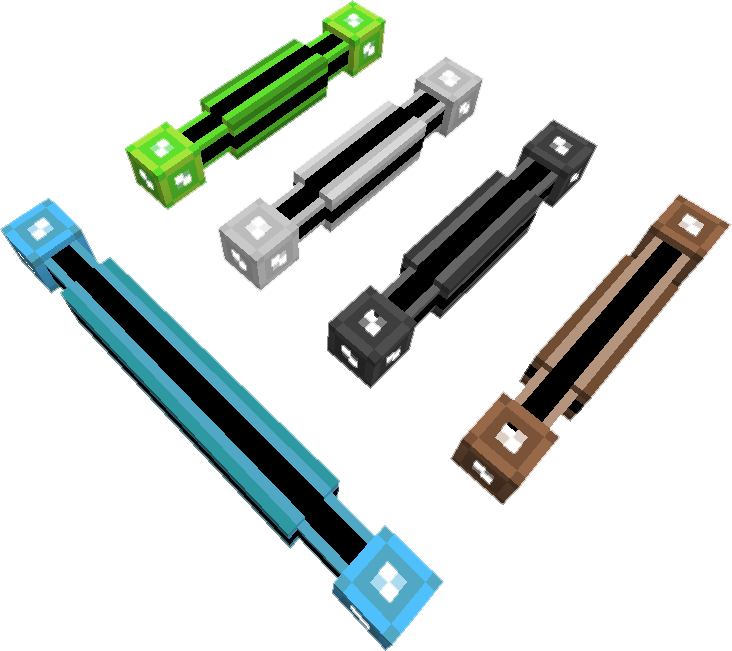

---
categories:
  - ME Network/Network Connections
item_ids:
  - appliedenergistics2:white_smart_cable
  - appliedenergistics2:orange_smart_cable
  - appliedenergistics2:magenta_smart_cable
  - appliedenergistics2:light_blue_smart_cable
  - appliedenergistics2:yellow_smart_cable
  - appliedenergistics2:lime_smart_cable
  - appliedenergistics2:pink_smart_cable
  - appliedenergistics2:gray_smart_cable
  - appliedenergistics2:light_gray_smart_cable
  - appliedenergistics2:cyan_smart_cable
  - appliedenergistics2:purple_smart_cable
  - appliedenergistics2:blue_smart_cable
  - appliedenergistics2:brown_smart_cable
  - appliedenergistics2:green_smart_cable
  - appliedenergistics2:red_smart_cable
  - appliedenergistics2:black_smart_cable
  - appliedenergistics2:fluix_smart_cable
  - appliedenergistics2:white_smart_dense_cable
  - appliedenergistics2:orange_smart_dense_cable
  - appliedenergistics2:magenta_smart_dense_cable
  - appliedenergistics2:light_blue_smart_dense_cable
  - appliedenergistics2:yellow_smart_dense_cable
  - appliedenergistics2:lime_smart_dense_cable
  - appliedenergistics2:pink_smart_dense_cable
  - appliedenergistics2:gray_smart_dense_cable
  - appliedenergistics2:light_gray_smart_dense_cable
  - appliedenergistics2:cyan_smart_dense_cable
  - appliedenergistics2:purple_smart_dense_cable
  - appliedenergistics2:blue_smart_dense_cable
  - appliedenergistics2:brown_smart_dense_cable
  - appliedenergistics2:green_smart_dense_cable
  - appliedenergistics2:red_smart_dense_cable
  - appliedenergistics2:black_smart_dense_cable
  - appliedenergistics2:fluix_smart_dense_cable
title: ME Smart Cable
---

While bearing
some similarity to <ItemLink
id="appliedenergistics2:fluix_covered_cable"/> in appearance, they
provide diagnostic function by visualizing the channel usage on the cables,
the channels appear as lit colored lines that run along the black stripe on
the cables giving you an understanding of how your channels are being used on
your network. The first four channels show as lines matching the color of the
cable, the next four show as white lines.

These can also be colored in the same manner as <ItemLink
id="appliedenergistics2:fluix_glass_cable"/>.

<RecipeFor id="appliedenergistics2:fluix_smart_cable" />
