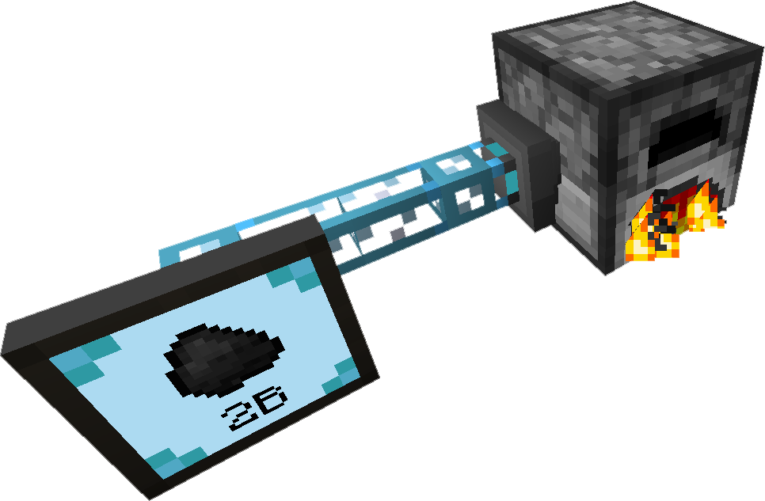

---
categories:
  - ME Network/Network Functions
item_ids:
  - appliedenergistics2:item_export_bus
related:
  - Possible Upgrades
title: ME Export Bus
---

The <ItemLink id="appliedenergistics2:item_export_bus"/> extracts items from the
[ME Network](../../me-network.md)'s Networked Storage and places them into the inventory it faces.
You must configure which items it will insert, leaving the configuration blank will result in nothing.

The <ItemLink id="appliedenergistics2:item_export_bus"/> will try to export any of the items on its list
skipping over those it cannot fit into the destination.

The <ItemLink id="appliedenergistics2:item_export_bus"/> requires a [channel](../channels.md) to function.

This is the functional opposite of the <ItemLink id="appliedenergistics2:item_import_bus"/>.

<RecipeFor id="appliedenergistics2:item_export_bus" />
