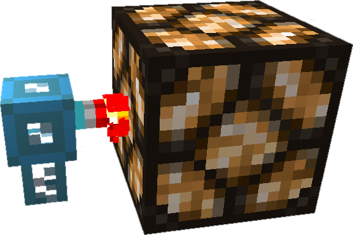

---
categories:
  - ME Network/Network Functions
item_ids:
  - appliedenergistics2:item_level_emitter
related:
  - Possible Upgrades
title: ME Level Emitter
---

The <ItemLink
id="appliedenergistics2:item_level_emitter"/> can indicate either the
level of a specified item or the [ME Network](../../me-network.md) energy
level. You can set the threshold and if the <ItemLink
id="appliedenergistics2:item_level_emitter"/> will emit a redstone signal
or turn it off.

Requires a [channel](../channels.md) to function, if its power or
channel is lost the emitter will switch to an off state.

These can tap into the crafting system when a crafting card is installed,
allowing you to output redstone while an item is being crafted, or even
configure the system to output redstone to preform a crafting task, its
important to note that you cannot mix level emitter craft via redstone with
interface patterns.

<RecipeFor id="appliedenergistics2:item_level_emitter" />
