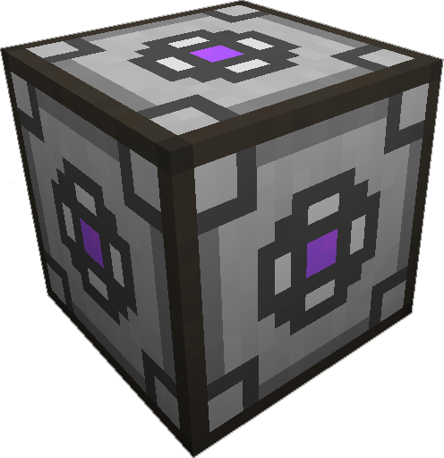

---
categories:
- ME Network/Network Power
item_ids:
  - appliedenergistics2:energy_acceptor 
  - appliedenergistics2:cable_energy_acceptor 
title: Energy Acceptor
---

The
<ItemLink id="appliedenergistics2:energy_acceptor"/> converts energy
from external systems into AE and stores it into the [ME Network](../ME-
Network/index.html).

Currently supported energy conversions are:

IndustrialCraft 2

    1 EU = 2 AE
Thermal Expansion 3

    2 RF = 1 AE
RotaryCraft

    11256 Watts/Joules = 1 AE
Mekanism

    5 J = 1 AE

<RecipeFor id="appliedenergistics2:energy_acceptor"/>
