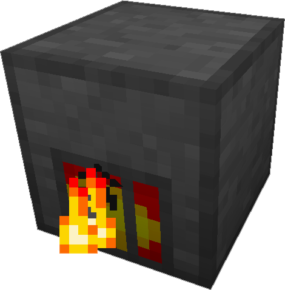

---
categories:
  - ME Network/Network Power
item_ids:
  - appliedenergistics2:vibration_chamber
title: Vibration Chamber
---

A
modified furnace capable of generating AE Power instead of smelting ores. When
placed on an [ME Network](../../me-network.md) it will charge <ItemLink
id="appliedenergistics2:energy_cell"/> or power other Network
Devices.

The <ItemLink id="appliedenergistics2:vibration_chamber"/> will burn
almost any solid burnable fuel for power. It will slow, or accelerate the burn
depending on how much power it is able to store vs what is wasted. Generates
between 1 and 10 AE/t depending on its burn speed.

<RecipeFor id="appliedenergistics2:vibration_chamber"/>
