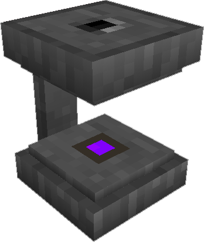

---
categories:
  - ME Network/Powered Machines
item_ids:
  - ae2:charger
related:
  - Supported Tools
title: Charger
---

The <ItemLink id="charger"/> provides a way to charge
supported tools through the [ME Network](../../me-network.md).

Power can be provided via the top or bottom, via either <ItemLink
id="fluix_glass_cable"/> or other Cables, or
other mod power cables. Items can be inserted or removed from any side.

Can also be used to create <ItemLink id="charged_certus_quartz_crystal"/>
from <ItemLink id="certus_quartz_crystal"/>.

<RecipeFor id="charger" />
