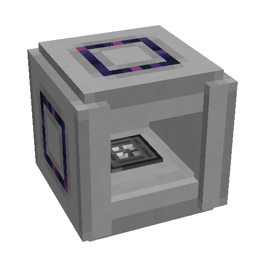
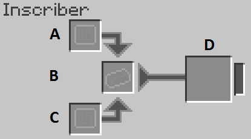

---
categories:
  - ME Network/Powered Machines
item_ids:
  - appliedenergistics2:inscriber
related:
  - Presses
title: Inscriber
---

The inscriber is used to press items using various Inscriber Plates. Each operation requires 1k AE charged up.

<CategoryIndex category="Presses" />

### Recipe

<RecipeFor id="appliedenergistics2:inscriber" />

### The GUI

A. **Top Input** automated from side with top press

B. **Center Input** automated from any side without press

C. **Bottom Input** automated from side with bottom press

D. **Output** automated from any side without press

### Upgrades

The inscriber supports the following upgrades:

- <ItemLink id="appliedenergistics2:speed_card" />
