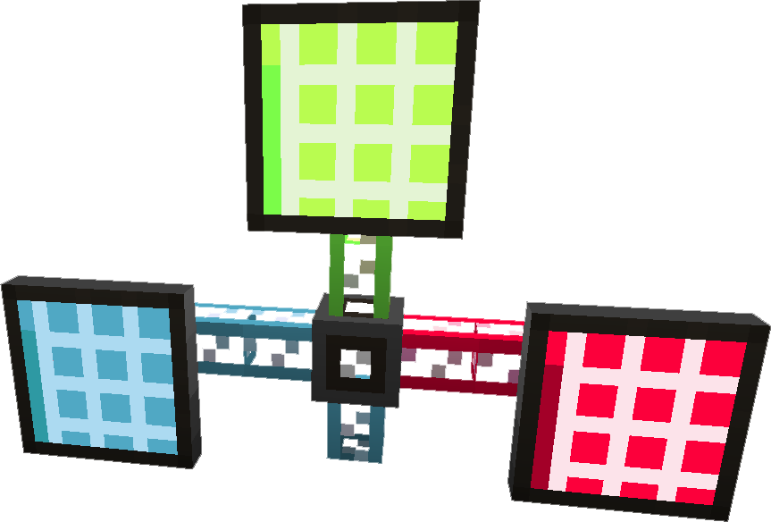
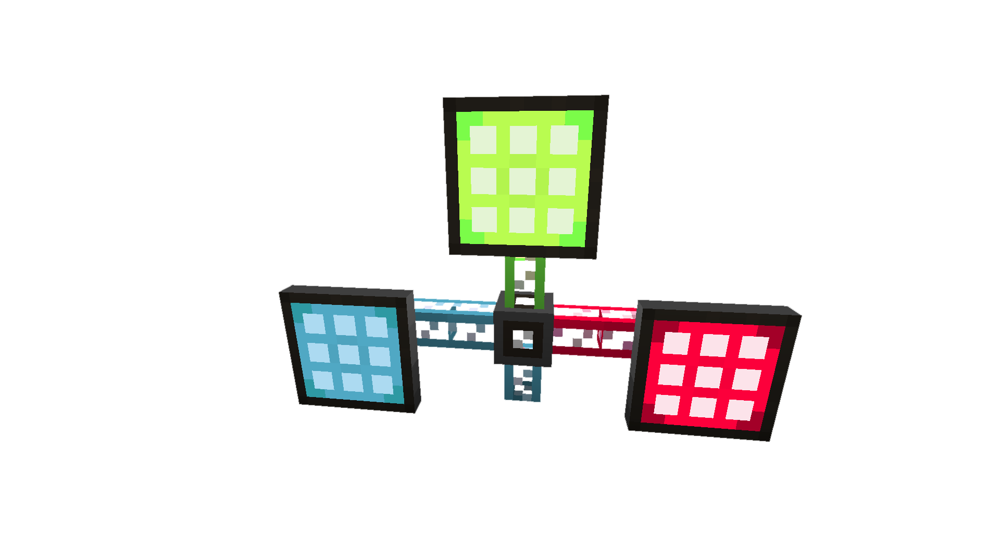

---
item_ids:
  - ae2:crafting_terminal
  - ae2:terminal
  - ae2:pattern_access_terminal
  - ae2:pattern_encoding_terminal
title: Terminals
---

## Item Terminal

The <ItemLink id="terminal"/> is a HID which gives you access
to items stored in your [ME Network](../me-network.md). This will also include
items accessible through <ItemLink id="storage_bus" />.

It has the ability to sort and search, as well as filter by using <ItemLink
id="view_cell"/>. It requires a [channel](channels.md) to function.

Can be upgraded into a <ItemLink id="crafting_terminal"/>.

<RecipeFor id="terminal" />

## Item Crafting Terminal

The <ItemLink id="crafting_terminal"/> is the upgraded version of the <ItemLink
id="terminal"/> which has an integrated crafting grid with access to
a [ME Network](../me-network.md)'s Networked Storage.

Like the <ItemLink id="terminal"/> it also requires a [channel](channels.md) to function.

<RecipeFor id="crafting_terminal" />

## Pattern Provider Terminal

Gives remote access to all interface pattern slots on your network separated
by which type of machine they are on. It will show the type of machine in the
terminal, however you can name the <ItemLink id="interface"/> in the <ItemLink
id="inscriber"/> or an Anvil to alter the name
displayed in the <ItemLink id="pattern_access_terminal"/>.

Combined with the fact that you can toggle if the interface shows up at all
this gets you control over your itnerface terminal's display.

<RecipeFor id="pattern_access_terminal" />

## Pattern Terminal

A specialized version of the <ItemLink id="crafting_terminal"/> designed to
encode <ItemLink id="blank_pattern"/> into <ItemLink id="crafting_pattern"/>
or <ItemLink id="processing_pattern"/>.

See [auto crafting](../auto-crafting.md) for more details on automated crafting in general.

Lets you browse the contents of your network like other terminals, but also
contains an area for designing patterns. There are two modes for pattern
encoding. Crafting Patterns, and Processing Patterns. Processing patterns are
designed for use with machines that do not use standard crafting recipes; such
as furnaces, or other machines. To select between modes, click the button to
the right of the interface; when it shows a standard crafting table, it will
create Crafting Patterns, and when it shows a furnace, it will create
Processing Patterns.

For Crafting Patterns ("Crafts..."), you specify the input crafting materials
on a standard 3x3 crafting grid, and the output materials are determined
automatically.

For Processing Patterns ("Creates..."), you specify the input materials and
output materials, including quantity, by placing stacks of items in the
interface. If a processing operation is not guaranteed to succeed (such as
secondary products from some machines), it will not work correctly as a
Processing Pattern.

When designing crafting patterns you can click the output to extract a crafted
item as long as you have the materials required to craft the item.

<RecipeFor id="pattern_encoding_terminal" />
