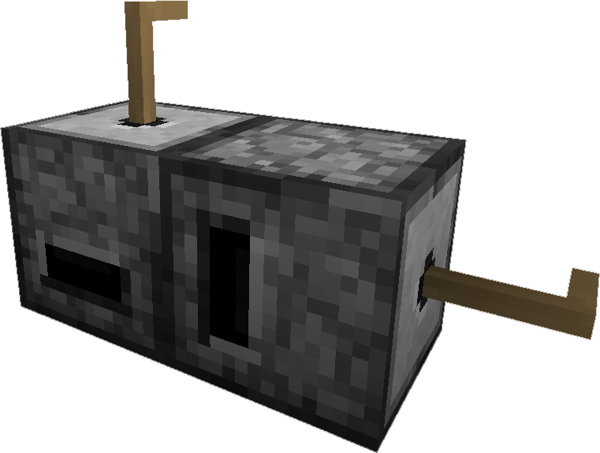

---
categories:
- Simple Tools/Grindstone
item_ids:
  - appliedenergistics2:grindstone
title: Quartz Grindstone
---

The <ItemLink
id="appliedenergistics2:grindstone"/> provides a low tech solution
for getting more out of your mining trips. It is much cheaper than its more
high-tech counter parts of other mods, but it is slow and a considerable time
sink, but what else do you have to do while smelting those dusts? Why not
grind up some other ores into dusts?

### Dusts

Applied Energistics 2 adds <ItemLink
id="appliedenergistics2:iron_dust"/>, <ItemLink
id="appliedenergistics2:gold_dust"/>, <ItemLink
id="appliedenergistics2:ender_dust"/>, <ItemLink
id="appliedenergistics2:nether_quartz_dust"/> and <ItemLink
id="appliedenergistics2:flour"/> in addition to <ItemLink
id="appliedenergistics2:certus_quartz_dust"/>, <ItemLink
id="appliedenergistics2:fluix_dust"/> and <ItemLink
id="appliedenergistics2:sky_dust"/> for its own world generation.
Grinding ingredients yields a chance to double the output for most materials (
90% chance ). Which provides a earily method for increasing the amount of
<ItemLink id="minecraft:gold_ingot"/>, <ItemLink
id="minecraft:iron_ingot"/> and most other metals added by other
mods. You can also get more <ItemLink id="minecraft:bread"/> from
less wheat.

<ItemGrid>
  <ItemIcon id="appliedenergistics2:gold_dust" />
  <ItemIcon id="appliedenergistics2:iron_dust" />
  <ItemIcon id="appliedenergistics2:certus_quartz_dust" />
  <ItemIcon id="appliedenergistics2:flour" />
  <ItemIcon id="appliedenergistics2:nether_quartz_dust" />
  <ItemIcon id="appliedenergistics2:sky_dust" />
  <ItemIcon id="appliedenergistics2:fluix_dust" />
  <ItemIcon id="appliedenergistics2:ender_dust" />
</ItemGrid>

### Setting up the Quartz Grind Stone

Craft yourself a pair of <ItemLink id="appliedenergistics2:grindstone"/> and <ItemLink id="appliedenergistics2:crank"/>

<CategoryIndex category="Simple Tools/Grindstone" />

Once you have that set the <ItemLink
id="appliedenergistics2:grindstone"/> on the ground, place the
<ItemLink id="appliedenergistics2:crank"/> on the side with the
hole, holding shift will ensure the crank is placed instead of opening the
grindstone gui.

### The GUI

|

  1. **Input**
  2. **Processing**
  3. **Output**

  
---|---
  
### Using the Grind Stone

Add ores / crystals or any other items into the bottom block's top left slots
to be ground, and right clicking on the crank to grind the ores. If there are
no more items left to grind, the crank will stop turning. The crank will break
into few <ItemLink id="minecraft:stick"/> on over usage, if the
<ItemLink id="appliedenergistics2:crank"/> is empty.

### Ore Dictionary and Other Mod Support

You can configure which ores can be processed in the <ItemLink
id="appliedenergistics2:grindstone"/> via the configuration by
specifiying their ore dictionary name. AE2 will always use the default 1 ore
-> 2 dust ration for this, however it is up to you, to ensure that this is
balanced. By default it includes the basic setup.

<RecipeFor id="appliedenergistics2:grindstone"/>
