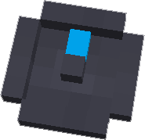

---
categories:
- World Gen
item_ids:
  - appliedenergistics2:sky_compass
title: Meteorite Compass
---

A
compass which points to the nearest <ItemLink
id="appliedenergistics2:sky_stone_block"/> in the current world, it
has a max range of roughly 2,700 blocks.

If it is spinning rapidly it means the current chunk your standing in contains
skystone. If its spinning slowly, it means that there is no metorite in range,
this usually means you should do some more exploring, it will find one as new
terrain is generated, or in some cases such as the nether you can use skystone
blocks to control the compass since skystone dosn't spawn natrually.

<RecipeFor id="appliedenergistics2:sky_compass"/>
