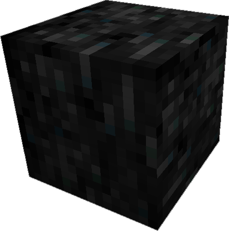
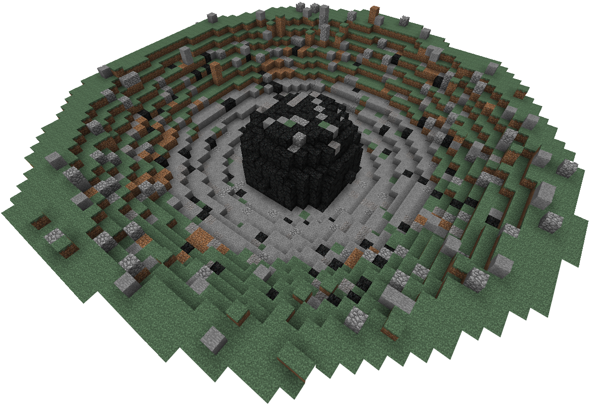

---
categories:
- World Gen
item_ids:
  - appliedenergistics2:sky_stone_block
title: Sky Stone
---

<ItemLink id="appliedenergistics2:sky_stone_block"/> is a blast resistant dark
stone block found in meteorites that have impacted the surface in the distant
or semi recent past. Their origin is unknown however they appear to contain
remnant of technology from another place.

<ItemLink id="appliedenergistics2:sky_stone_block"/>

is extremely hard and requires at least a diamond pick to mine it, the
processed variants can be removed with any pick however.

Can be ground into <ItemLink id="appliedenergistics2:sky_dust"/>.

### Decorative Blocks

<CategoryIndex category="Decorative Blocks/Skystone Blocks" />  
  
### Meteorites

Meteorites spawn during world generation on the surface or underground and
vary in size. They generally contain a <ItemLink
id="appliedenergistics2:sky_stone_chest"/> which can contain various
ingredients required for advanced technology. You can use a <ItemLink
id="appliedenergistics2:sky_compass"/> to locate meteorites near you
and as you explore.

